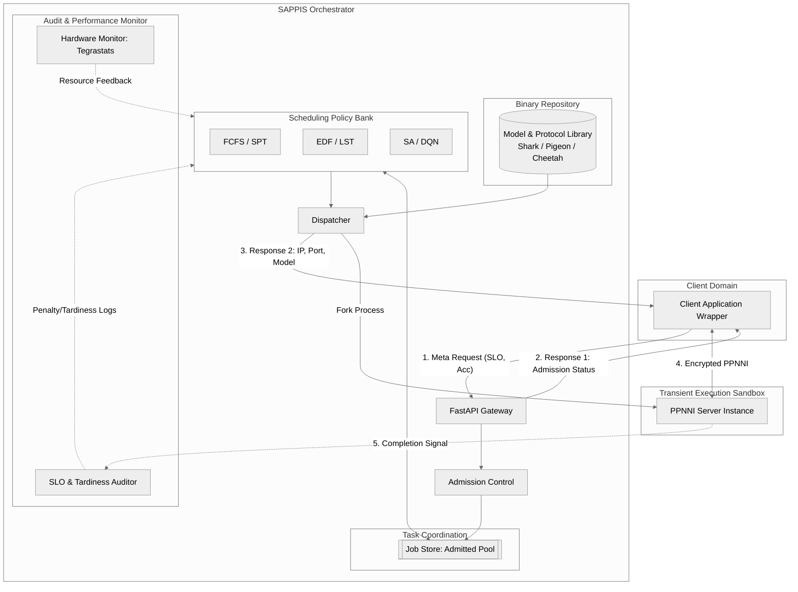
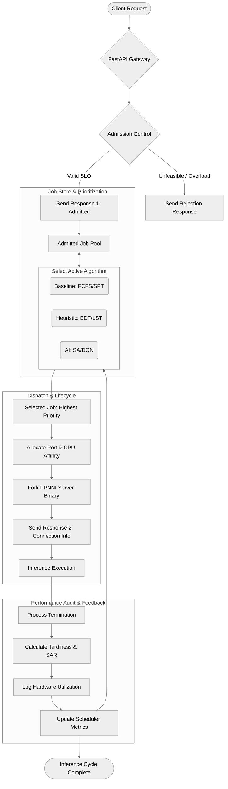

This document presents the formal specification for **SAPPIS**, a framework designed to bridge the gap between heavy cryptographic privacy protocols and real-time edge computing constraints.

---

# SAPPIS: An SLO-Aware Privacy-Preserving Inference Scheduler for Resource-Constrained Edge Computing

## 1. Introduction and Motivation
Privacy-Preserving Neural Network Inference (PPNNI) enables a server to perform inference on encrypted data without accessing the raw input. Protocols such as **Shark**, **Pigeon**, and **OpenCheetah** leverage Multi-Party Computation (MPC) and Homomorphic Encryption (HE) to achieve this. However, these protocols introduce massive computational overhead (10x–1000x plaintext latency) and require a synchronized "one-shot" execution between client and server.

On resource-constrained Edge devices (e.g., NVIDIA Jetson AGX Orin), these overheads lead to resource exhaustion and high tail latencies. **SAPPIS** is a centralized scheduling authority that manages transient PPNNI server processes, ensuring that computational resources are allocated to satisfy Service Level Objectives (SLOs) while maximizing system efficiency.

### 1.1 Target Applications
Applications requiring SAPPIS are characterized by high privacy sensitivity and strict timing requirements:
*   **Remote Medical Diagnostics:** A clinic sends encrypted MRI scans to an Edge-AI node for real-time tumor detection. SLO is critical for surgical decision support.
*   **Financial Fraud Detection:** Real-time encrypted transaction analysis where late detection results in financial loss.
*   **Privacy-Preserving Biometrics:** Encrypted facial recognition for secure facility access. Delays $>1$ second result in poor user experience and throughput bottlenecks.
*   **Industrial Defect Detection:** Collaborative privacy-preserving vision where proprietary manufacturing data must remain confidential while maintaining production line speed.

---

## 2. Problem Formulation

We model the Edge server as a resource-limited provider $\mathcal{E}$. A stream of requests $J$ arrives according to a Poisson process. Each request $J_i$ is defined as:

$$J_i = \langle A, M, B, L, W \rangle$$

*   **Arrival ($A$):** Timestamp of entry into the Gateway.
*   **Model Selection ($M$):** Target architecture or minimum accuracy threshold ($Acc_{min}$).
*   **Batch Size ($B$):** Number of encrypted samples in the request.
*   **Latency Budget ($L$):** The SLO threshold (Total residence time allowed).
*   **Weight ($W$):** Priority coefficient (e.g., 1 to 10).

### 2.1 Optimization Objectives
The scheduler $\mathcal{S}$ aims to find a mapping of jobs to time slots and hardware that optimizes the following:

1.  **Maximize SLO Attainment Ratio (SAR):** $\frac{1}{N} \sum \mathbb{1}(Finish_i - A_i \leq L_i)$.
2.  **Minimize Total Tardiness:** $\sum \max(0, Finish_i - (A_i + L_i))$.
3.  **Maximize System Goodput:** Total successful batch inferences per second.
4.  **Minimize Average Turnaround Time (TAT):** Average of $(Finish_i - A_i)$.
5.  **Maximize Resource Utilization:** Efficient occupancy of GPU/CPU while avoiding contention-induced thrashing.

---

## 3. System Architecture

SAPPIS decouples the **Control Plane** (Management) from the **Data Plane** (Execution).

[![](https://mermaid.ink/img/pako:eNqFVWFv4jgQ_SsjSxy7EqUNhF6IViuloVAqaMOFPaQLFTKJCxbBzjnObVnKf79JQguF3bt8gMTz3sz4-U2yJaGMGLFJpbLlgmsbtlW9ZGtWtaEqWKYVjas1KNf-pIrTecxSDG6h-iyF9vmPAmpYyUuOy9e6dM3jTb7qID6u7na7SmUqFoomSxh3pgLwSrN5ueDGnAk98xMaMgjKJ-jINeXiqYTml_sWcZIk5iHVXAqYYIKEqT2MiWgqTpNjO0rGMy-mArP7juf1fXhU4ZKluDUt1VGN3iTo0lQ7Xh96VLPvdPMEFxdfwXEDJ1rzNM1r7jMe0Q5372VHGcvYbEgFXaBs2HUwpukKuVJFXBTNHyXIr_tRENzLOfjYErMhr6c1i8CTWOsIW2zyvLLjFp3ej_6zLR-3HWUxU7NbseCFIOUKFwushLpu4IaK1UlvEVcsLAQf33yMOIOeEXTdrg-X4Hvjp7NoI7jtdDE48H8SbOJ5YKwzevj_DR72gAKhqhDcoJBqA3-wRKYcFzcnBQb9m-DTEM0dw2_gKallKGMY8LlC2pe5uvzqL6laYQMeXzDc3CW4S8Y0XX4-becnbQylyIuicLNveAeBk0X4h5WYepZqTQW6eQ86aexuMhs-PgR3VEXfqXpH2TBmmDvVVKenWn3r9MeBP3jE_GOaW4ilKRQVP2Q_afZ-BF9yV5we-wFxZogc3un7XtDhaUI1ho_zo6TviF_PXIdq-jZwY0VFWszt7QsLs8JEPhXRXL4c5fV8I_C8h4c--Ez9wxT0BcqACp5PdqUCd8hPl3TFUA1XrteZ2L8PSkQ-CTAlRh2GeJjoj78znHX4hPLVwAnDz1NSbKI3KfG9SUlo1BGbJlKkDIxyAsuJ9_FEsnTPcktS-ZvrUJKbR-SGDX2vhvOkdA0KA37kHlhdif5Da4Z4nHsMSnFcwS1P8NWsw60I1SYp3gm5VK-nUHyEi3oObtVzXZKYlXLzhaDxa2miElo6cI_GvmWm0K1dxqI5DVevvzBMkWBP8hjm1JvLgxsHcpGeM0mNLBSPiP1M45TVyJrhaOTPZJsnnZLiuzIlNt5G7JlmsZ6SqdghL6HiLynXxNYqQ6aS2WL59pAlEb6gO5yi4w4ItAlTrsyEJrbRajWLHMTekhdim1dW3WpYltUyjd_Npnl9XSMbYl8YplVvtCyr2TKv2m2raexq5EdR9qrevjabbdM0Wm3DujZMZLBi4oblF7P4cO7-BZ3hLHo?type=png)](https://mermaid.live/edit#pako:eNqFVWFv4jgQ_SsjSxy7EqUNhF6IViuloVAqaMOFPaQLFTKJCxbBzjnObVnKf79JQguF3bt8gMTz3sz4-U2yJaGMGLFJpbLlgmsbtlW9ZGtWtaEqWKYVjas1KNf-pIrTecxSDG6h-iyF9vmPAmpYyUuOy9e6dM3jTb7qID6u7na7SmUqFoomSxh3pgLwSrN5ueDGnAk98xMaMgjKJ-jINeXiqYTml_sWcZIk5iHVXAqYYIKEqT2MiWgqTpNjO0rGMy-mArP7juf1fXhU4ZKluDUt1VGN3iTo0lQ7Xh96VLPvdPMEFxdfwXEDJ1rzNM1r7jMe0Q5372VHGcvYbEgFXaBs2HUwpukKuVJFXBTNHyXIr_tRENzLOfjYErMhr6c1i8CTWOsIW2zyvLLjFp3ej_6zLR-3HWUxU7NbseCFIOUKFwushLpu4IaK1UlvEVcsLAQf33yMOIOeEXTdrg-X4Hvjp7NoI7jtdDE48H8SbOJ5YKwzevj_DR72gAKhqhDcoJBqA3-wRKYcFzcnBQb9m-DTEM0dw2_gKallKGMY8LlC2pe5uvzqL6laYQMeXzDc3CW4S8Y0XX4-becnbQylyIuicLNveAeBk0X4h5WYepZqTQW6eQ86aexuMhs-PgR3VEXfqXpH2TBmmDvVVKenWn3r9MeBP3jE_GOaW4ilKRQVP2Q_afZ-BF9yV5we-wFxZogc3un7XtDhaUI1ho_zo6TviF_PXIdq-jZwY0VFWszt7QsLs8JEPhXRXL4c5fV8I_C8h4c--Ez9wxT0BcqACp5PdqUCd8hPl3TFUA1XrteZ2L8PSkQ-CTAlRh2GeJjoj78znHX4hPLVwAnDz1NSbKI3KfG9SUlo1BGbJlKkDIxyAsuJ9_FEsnTPcktS-ZvrUJKbR-SGDX2vhvOkdA0KA37kHlhdif5Da4Z4nHsMSnFcwS1P8NWsw60I1SYp3gm5VK-nUHyEi3oObtVzXZKYlXLzhaDxa2miElo6cI_GvmWm0K1dxqI5DVevvzBMkWBP8hjm1JvLgxsHcpGeM0mNLBSPiP1M45TVyJrhaOTPZJsnnZLiuzIlNt5G7JlmsZ6SqdghL6HiLynXxNYqQ6aS2WL59pAlEb6gO5yi4w4ItAlTrsyEJrbRajWLHMTekhdim1dW3WpYltUyjd_Npnl9XSMbYl8YplVvtCyr2TKv2m2raexq5EdR9qrevjabbdM0Wm3DujZMZLBi4oblF7P4cO7-BZ3hLHo)

### 3.1 Two-Stage Communication Logic
1.  **Admission Response (From Gateway):** Informs the client immediately if the request is accepted or rejected based on the feasibility of the SLO ($Estimated\_Execution < L$) and current load.
2.  **Dispatch Notification (From Dispatcher):** Sent only when a hardware slot is reserved and the PPNNI server is active. This contains the dynamic Port and IP needed for the client to pivot to the inference phase.

---

## 4. Scheduling Methodologies

SAPPIS evaluates a suite of algorithms to handle varying traffic densities:

### 4.1 Baseline Algorithms (SLO-Agnostic)
*   **First-Come-First-Served (FCFS):** Standard temporal ordering. It serves as a control group to identify the impact of queue-jumping on high-latency PPNNI tasks.
*   **Shortest Processing Time (SPT):** Prioritizes jobs with the lowest $e_i$ (Estimated Execution). While it maximizes throughput, it can lead to the starvation of complex models.

### 4.2 SLO-Aware Heuristics
- > *Deadline Monotonic priortiy assignement* (check for it)
*   **Earliest Deadline First (EDF):** Prioritizes based on absolute deadline ($A + L$). Effective for general workloads but fails to consider the actual compute time of the models.
*   **Least Slack Time (LST):** Calculates $Slack = (A + L) - (t + e_i)$. This is the primary heuristic for SAPPIS as it identifies "Zero-Slack" jobs that must be dispatched immediately to prevent failure.

### 4.3 Computational Intelligence Algorithms
*   **Simulated Annealing (SA):** Operates on a sliding window of the queue. It explores permutations of job sequences to minimize a cost function (Weighted Tardiness), using probabilistic transitions to escape local minima in complex scheduling landscapes.
*   **Deep Q-Network (DQN):** A Reinforcement Learning agent.
    *   **State:** [Queue Slack Vector, Current Hardware Load, Arrival Rate].
    *   **Action:** Select job $j$ from the window to dispatch.
    *   **Reward:** Positive for SLO attainment; heavy negative penalty for missed deadlines and idle resource time.

---

## 5. Execution Methodology Flow

This diagram details the internal state transitions and resource lifecycle.

[![](https://mermaid.ink/img/pako:eNp1VQ1P2zoU_SuWJWgnFegnC9H0pCxQYOpYXgNDWlohk9w2fnPjzHEGpep_f9dOGCl9L6pSf5xzj8-91-2GxjIB6tKDgw3PuHbJpqVTWEHLJa0MSq2YaHVItfadKc4eBRS4uSGthcx0yF8stOfkzwZn1sZsxcXarHqIF63tdntwMMsWQj7FKVOa3J7PMoJPqHHWjnzBIdNkCr9KKPT8Azk6-otc3m_GrNBecE0umYYntt5WpMt7u-_5Gy9Z8aLgMiM-qiopakT19nzEkRm9yxbACo7HJifk229QQrJkRm2Q6cWXKIQsQe1_INYm1BSKXGYFzHejfGeCJyScfKuZnu-_Mis86bnEHEhrSJBbsYvycalYnpJ7xjXPlg_oWAOJvshHNC8VkEMSKC4V7r4wo1_LVtK-lQqkFNFraGKoZqUBfBv90Quk4PH6IQRR24qqIfFw-huIJ5ZGNF01wpgn4aomTKa7O0Gv_ZkVIHgGLhn74_AkDG4_vMP021dQKl5oHrvk4nx8Mgn3MIO2d-2S0Ds5__umsYe5_C9Hxir5VKVh11KFsbRquOfZVhhYsq7NV9lzyRVfpthor5lfz5tt8yeFF88QlybOQ5CicRKd8yJnOk6xZhO-gHgdC2ikzyrVmkXkCSFjU-tAYsMfEj-4I95iYa7YeodUWMpYqp-ReZEguLm5JiEo7FTymWdMNfEWUmvk_Xcd2HfNRchq99fZQu4q5f2KWmYRboKCLIY3m_O9hCLQEm5BraJAyRiKwk7wVA3Gu7x5ZcL1w0TKnEQBqIVUK2aE7DpmYgyQPLL4Z-NsJqZV8pmII_MqhcndLVMJ9huqHmLDTBsMg7EMc6GKaCKX5ArBTwyv1J3mYv82WaCl3OUJBo-qLxLGKSSlwGR_Ba14XOznoUb-fxM2AGOscJG2Gwn2TZ9gYVa5AA1zbHnaoUvFE-oumCigQ1don5k53Zh4M2p_bGfUxWECC1YKPaOzbIu8nGU_pFxRV6sSmUqWy_R1UtpTnHOGdXhDoA9QviwzTd3eaPTRxqDuhj5Td9h1jp2-4zijYe_jcDA8Pe3QNXWPekPnuD9ynMFo2D07cwa9bYe-WNnu8dnpcHCGn-7IGXQHzqBDAesq1dfqb8T-m2z_BeVO94I?type=png)](https://mermaid.live/edit#pako:eNp1VQ1P2zoU_SuWJWgnFegnC9H0pCxQYOpYXgNDWlohk9w2fnPjzHEGpep_f9dOGCl9L6pSf5xzj8-91-2GxjIB6tKDgw3PuHbJpqVTWEHLJa0MSq2YaHVItfadKc4eBRS4uSGthcx0yF8stOfkzwZn1sZsxcXarHqIF63tdntwMMsWQj7FKVOa3J7PMoJPqHHWjnzBIdNkCr9KKPT8Azk6-otc3m_GrNBecE0umYYntt5WpMt7u-_5Gy9Z8aLgMiM-qiopakT19nzEkRm9yxbACo7HJifk229QQrJkRm2Q6cWXKIQsQe1_INYm1BSKXGYFzHejfGeCJyScfKuZnu-_Mis86bnEHEhrSJBbsYvycalYnpJ7xjXPlg_oWAOJvshHNC8VkEMSKC4V7r4wo1_LVtK-lQqkFNFraGKoZqUBfBv90Quk4PH6IQRR24qqIfFw-huIJ5ZGNF01wpgn4aomTKa7O0Gv_ZkVIHgGLhn74_AkDG4_vMP021dQKl5oHrvk4nx8Mgn3MIO2d-2S0Ds5__umsYe5_C9Hxir5VKVh11KFsbRquOfZVhhYsq7NV9lzyRVfpthor5lfz5tt8yeFF88QlybOQ5CicRKd8yJnOk6xZhO-gHgdC2ikzyrVmkXkCSFjU-tAYsMfEj-4I95iYa7YeodUWMpYqp-ReZEguLm5JiEo7FTymWdMNfEWUmvk_Xcd2HfNRchq99fZQu4q5f2KWmYRboKCLIY3m_O9hCLQEm5BraJAyRiKwk7wVA3Gu7x5ZcL1w0TKnEQBqIVUK2aE7DpmYgyQPLL4Z-NsJqZV8pmII_MqhcndLVMJ9huqHmLDTBsMg7EMc6GKaCKX5ArBTwyv1J3mYv82WaCl3OUJBo-qLxLGKSSlwGR_Ba14XOznoUb-fxM2AGOscJG2Gwn2TZ9gYVa5AA1zbHnaoUvFE-oumCigQ1don5k53Zh4M2p_bGfUxWECC1YKPaOzbIu8nGU_pFxRV6sSmUqWy_R1UtpTnHOGdXhDoA9QviwzTd3eaPTRxqDuhj5Td9h1jp2-4zijYe_jcDA8Pe3QNXWPekPnuD9ynMFo2D07cwa9bYe-WNnu8dnpcHCGn-7IGXQHzqBDAesq1dfqb8T-m2z_BeVO94I)
---

## 6. Performance Metrics and Audit

The Audit unit measures the following to ensure a rigorous comparison of algorithms:

1.  **SLO Attainment Ratio (SAR):** The percentage of jobs where $T_{residence} \leq L$.
2.  **Total/Mean Tardiness:** The cumulative delay beyond the SLO. Essential for distinguishing between an algorithm that misses a deadline by 10ms vs. one that misses by 10 seconds.
3.  **Goodput:** Total successful batch inferences per second.
4.  **Average Turnaround Time (TAT):** The mean time a request spends in the system (Queue time + Execution time).
5.  **Resource Contention Index (RCI):** 
    $$RCI = \frac{T_{observed}}{T_{baseline\_profile}}$$
    If $RCI > 1.2$, the dispatcher reduces concurrency to prevent performance degradation.
6.  **Energy Efficiency:** Successful inferences per Joule (specific to Edge hardware).
7.  **Scheduling Overhead:** The latency introduced by the scheduling algorithm itself. For LST, this is $O(N \log N)$; for DQN, it is the forward-pass time of the neural network.

---

## 7. Implementation Considerations (Hardware)
The target deployment platform is the **NVIDIA Jetson AGX Orin (64GB)**. 
*   **Resource Management:** The Dispatcher uses `taskset` for CPU core pinning and `CUDA_VISIBLE_DEVICES` for GPU isolation.
*   **Online Profiler:** Uses `tegrastats` to monitor real-time power and memory usage, feeding back into the LST/DQN algorithms to adjust $e_i$ estimates dynamically based on thermal or memory pressure.